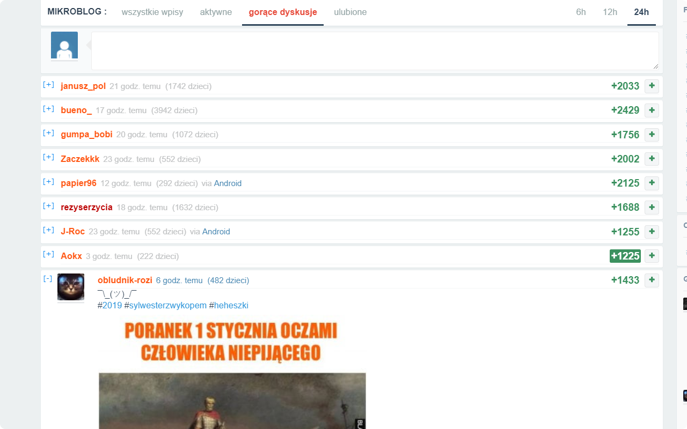

[](https://dev.azure.com/humberd/Wykop-plus-plus/_build/latest?definitionId=1?branchName=master)
[](https://vsrm.dev.azure.com/humberd/_apis/public/Release/badge/c81245c5-8aba-4588-a566-a3d5dc3703c2/2/2)

# Wykop++

Rozszerzenie zapewniające dodatkowe funkcjonalności dla portalu [Wykop.pl](Wykop.pl).


#### Dostępne na:

[](https://chrome.google.com/webstore/detail/wykop%20%20/fdoonokgdbeahghjlmlfbbdopggbacio)
[](https://addons.mozilla.org/pl/firefox/addon/wykop-plus-plus/)


### Funkcjonalności:
 * Umożliwia chowanie komentarzy - stan jest zapamiętywany.
 * Wyświetla liczbę komentarzy per rodzic.
 * Infinite scroll _(TODO)_.
 * Oznaczenie przeczytanych komentarzy _(TODO)_.
 * TTL zapisanego stanu chowanych komentarzy _(TODO)_.

## Wymagania:

 * node 10.8.0 (inne wersje nie były testowane)

## Instalacja:

```sh
npm ci
```

## Budowanie:

```sh
npm run build-prod
```

### Screeny:




## Issues and contributions:

Jeśli dostrzegłeś jakiś problem utwórz Issue, lub zrób Pull Request.
